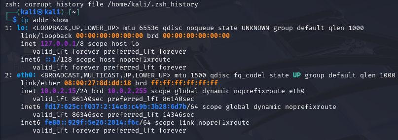
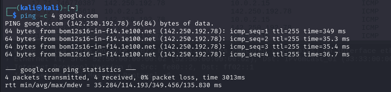

# Internship-Elevatelabs-task5

## Task 5  : Capture and Analyze Network Traffic Using Wireshark.

### Objective: 

Capture live network packets and identify basic protocols and traffic types.
 
### Tools:

Wireshark 

### Deliverables:  

A packet capture (.pcap) file and a short report of protocols identified

### Solution:

#### Step 1: 

Install Wireshark. Since I am using kali linux wireshark is pre installed. Select active network interface (usually eth0, wlan0, or similar). To check this I use command ip addr show.

#### Step 2:

Open Wireshark (GUI). Click Start Capturing Packets (the blue shark fin). Now I Generate Some Traffic

While Wireshark is capturing:

•	Run a ping in the terminal:

•	Then I Open a browser and visit website (e.g. www.geeksforgeek.com)

•	Let it run for ~5 minute.
•	Click the red stop button in Wireshark.

